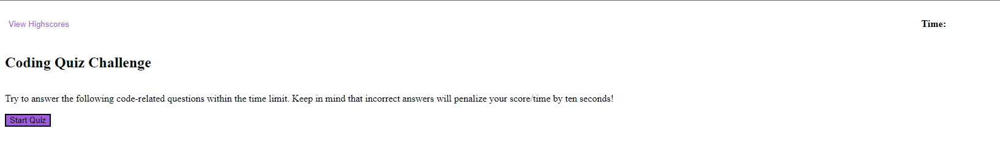

# Coding-Quiz

## Description
This program is a mini timed quiz related to JavaScript knowledge. The user is presented with 5 multiple-choice questions with 4 possible choices for each. When the user selects an answer, the program tells them if they were correct or not. If the user is incorrect, the time remaining is deducted by 10 seconds. At the end of the quiz, the user's remaining time is their final score. Scores are saved to the local storage so the user can see their high scores. The program has an option to view saved highscores and clear them all should the user choose to.

## Links 

Repository:
https://github.com/JacksonR-K/Coding-Quiz

Deployed Application:
https://jacksonr-k.github.io/Coding-Quiz/

## Credits

© 2022 edX Boot Camps LLC. - For the questions used in the quiz

https://stackoverflow.com/questions/8260156/how-do-i-create-dynamic-variable-names-inside-a-loop